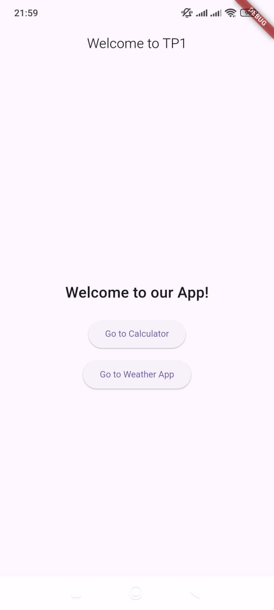
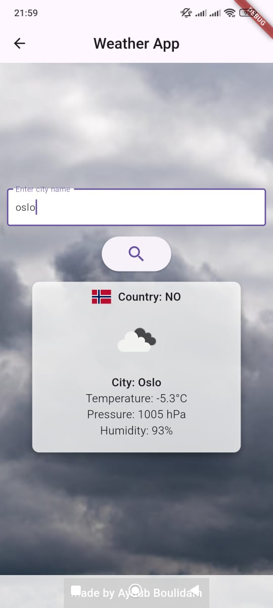
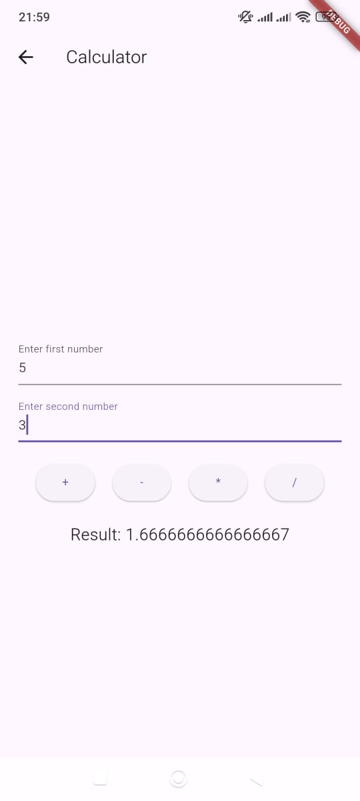

# Academic Project: Weather and Calculator App with Flutter

This project, part of our academic studies, is developed using **Flutter**, a versatile cross-platform framework. The app combines two functionalities: a **Weather App** and a **Calculator**, with seamless routing and navigation between screens.

The **Weather App** fetches real-time weather data using the **Weather Map API**, showcasing the integration of external APIs into a Flutter project.

Below are preview images of the app:

- **Home Screen**  
  

- **Weather App Screen**  
  

- **Calculator Screen**  
  

